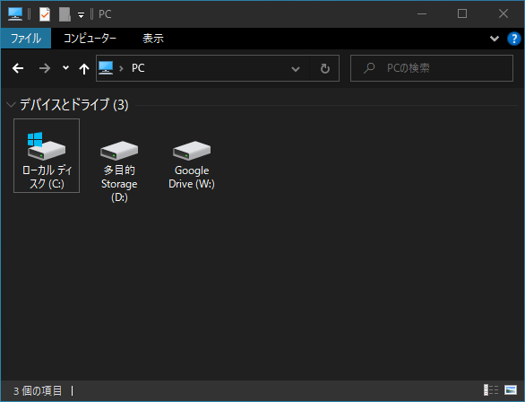

# ふじつぼ Fujitsubo-automatic-barnacle
Windows 10 で "PC" 内の個人フォルダの表示・非表示を切り替えるソフトです。 
Toggle Show/Hide folders in "This PC" on Windows 10! 

---

## クイックガイド
### ダウンロード
GitHubページ（ここ）の右にある"Releases"からダウンロード可能です。

### 使い方
1. `fujitsubo.exe`を**管理者として**実行する（レジストリ情報の取得に多少時間がかかります）。
1. 非表示にしたいフォルダの**チェックを外す**（表示しておきたいフォルダのチェックはそのまま）。
1. 「変更を適用」ボタンを押す。

### 元に戻すには...
すべてのフォルダにチェックを入れて、「変更を適用」します。

## 動作の仕組み
レジストリの書き換えによって表示を切り替えています。 
これは`HKEY_LOCAL_MACHINE\SOFTWARE\Microsoft\Windows\CurrentVersion\Explorer\MyComputer\NameSpace\`以下のキーを`regedit.exe`で書き換えることと同じです。 
~~これは`HKEY_LOCAL_MACHINE\SOFTWARE\Microsoft\Windows\CurrentVersion\Explorer\FolderDescriptions`以下の値を`regedit.exe`で書き換えることと同じです。~~ 
よって万が一の時は手動で書き換えることもできます。

## 既知の問題点
<!-- - "PC" だけでなくユーザフォルダ`%USERPROFILE%`からも隠れてしまう（かなり致命的ですが仕様なんです……）。
    - → 回避策:`%HOMEPATH%`からアクセスする。
 -->
- レジストリの読み込みに時間がかかる。

## 告知事項
作者はこのソフトウェアに不具合のないことを保証しません。
このソフトウェアを使用することにより発生した、いかなる損害に対しても、作者は責任を負いません。
自己の判断において、潜在的な不具合の危険性を承知の上で使用してください。

本ソフトウェアはGNU GENERAL PUBLIC LICENSEの下で公開されます。
当該ライセンスに従う限り、改変や再頒布が許可されます。
詳しくは`LICENSE`を参照のこと。

## 基本情報
|**アプリ名**|ふじつぼ|
|:---:|:---:|
|**バージョン**|0.2.0|
|**作者**|inucat|
|**開発言語**|Hot Soup Processor 3|
|**動作環境**|Windows 10 64bit版|
|**対応言語**|日本語|
|**ライセンス**|GNU GENERAL PUBLIC LICENSE|

## 窓口
不具合報告などは下記まで。
- Twitter: @inucat4
- Github: inucat

## 変更履歴
- 2021-03-03 v0.2.0 ユーザフォルダ`%USERPROFILE%`からは隠れないように仕様変更。
- 2021-03-02 v0.1.0 初版公開

<!--
---
(If the English description has any conflicts with the original Japanese one, the latter is correct.)

## Quick Start Guide
### Usage
1. Run `fujitsubo.exe` as *Administrator*
1. *Uncheck* folders to hide (leave them checked if you want them to be showed)
1. Press "Apply changes" button

### To revert...
Make sure all folders are checked then "Apply changes."

## How it works
`fujitsubo.exe` edits the registry values to toggle show/hide folders.
You can modify the `ThisPCPolicy` values under the key `HKEY_LOCAL_MACHINE\SOFTWARE\Microsoft\Windows\CurrentVersion\Explorer\FolderDescriptions` manually with `regedit.exe`. 

## Known issues
- It takes some long time to load the registry data.
    - Please be patient...

## NOTICE
There are NO WARRANTY that this software is perfect and without any bugs or glitches.
Therefore possible and potential risks may exist and may damage your system.
Use this software AT YOUR OWN RISK.

This software is distributed with the GNU GENERAL PUBLIC LICENSE.
You can redistribute it or modify it to release *as long as the LICENSE is followed.*
See `LICENSE` for details.

## Basic Information
|**Application Name**|Fujitsubo|
|:---:|:---:|
|**Version**|0.2.0|
|**Author**|inucat|
|**Built on**|Hot Soup Processor 3|
|**Required Environment**|Windows 10 64bit|
|**Language**|English, Japanese|
|**License**|GNU GENERAL PUBLIC LICENSE|

## Support
Use the media below if you want to report bugs:
- Twitter: @inucat4
- Github: inucat

-->